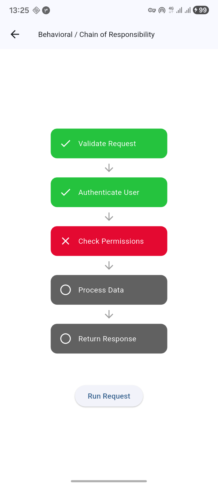

Design Patterns Visual Implementation


This project offers a visual and interactive exploration of common software design patterns .


Project Structure

```text
pattern_name/
├── pattern.dart
└── implementation.dart
```


Explanation:
pattern.dart
Defines a generic and asynchronous class.

implementation.dart
demonstrating how the pattern works in practice.


